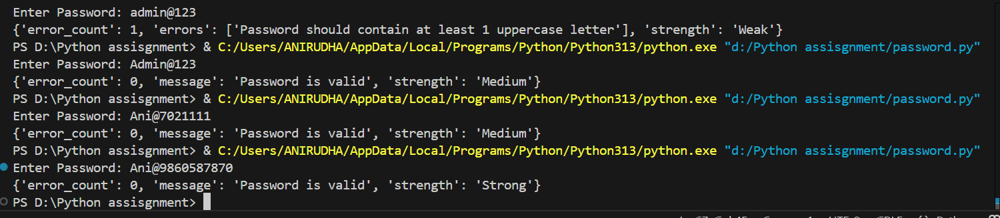
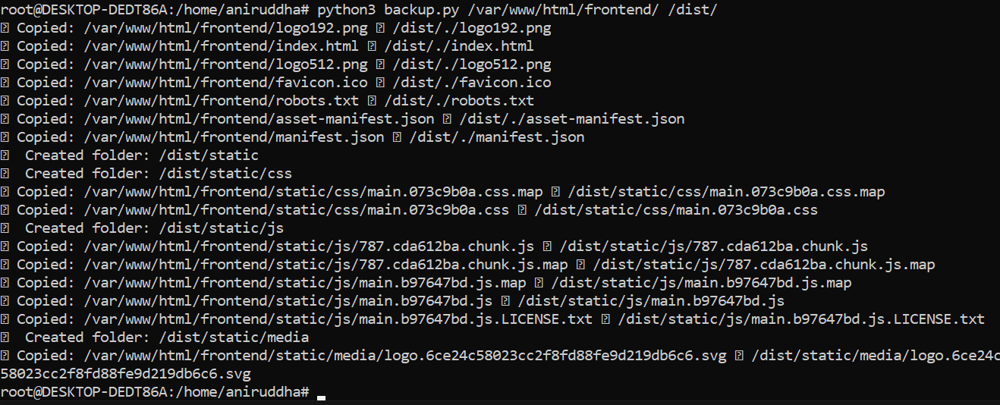

# 1. Checking Password Strength

## Description
This Python function validates and checks the strength of a password based on various security criteria. It ensures that passwords meet minimum security standards and categorizes their strength as **Weak, Medium, or Strong**.

## Features
- Validates password length (minimum 8 characters required)
- Ensures at least:
  - 1 uppercase letter (A-Z)
  - 1 lowercase letter (a-z)
  - 1 digit (0-9)
  - 1 special character (!, @, #, $, etc.)
- Prevents spaces within the password
- Assesses password strength based on:
  - Length (longer passwords score higher)
  - Number of special characters (more than 2 increases strength)
  - Combination of letters, numbers, and symbols
- Returns a detailed response including error messages and strength level

## Usage
### Function Definition
```python
def check_password_strength(password: str):
```
### Returns:
- **If the password is invalid:**
  - `error_count`: Number of validation errors
  - `errors`: List of reasons why the password is invalid
  - `strength`: "Weak"
- **If the password is valid:**
  - `error_count`: 0
  - `message`: "Password is valid"
  - `strength`: "Weak", "Medium", or "Strong"

### Example Usage
```python
password = "P@ssw0rd123!"
result = check_password_strength(password)
print(result)
```
### Example Outputs:
#### Weak Password:
```json
{
    "error_count": 3,
    "errors": [
        "Password should contain at least 1 uppercase letter",
        "Password should contain at least 1 digit",
        "Password should contain at least 1 special character"
    ],
    "strength": "Weak"
}
```
#### Strong Password:
```json
{
    "error_count": 0,
    "message": "Password is valid",
    "strength": "Strong"
}
```

## Installation & Requirements
- Python 3.x
- No external dependencies (uses built-in string functions)

## Best Practices for Strong Passwords
- Use at least **12+ characters**
- Include **uppercase, lowercase, numbers, and symbols**
- Avoid common words and patterns (e.g., "password123")
- Do not reuse passwords across accounts


## Output - Success



# 2.CPU Monitoring Script with Alerts

This Python script continuously monitors CPU usage and triggers alerts when the usage exceeds a specified threshold. 

## Features

- ✅ **Monitors CPU Usage** in real-time
- ♻️ Runs infinitely until manually stopped or an error occurs

## Prerequisites

Make sure you have Python installed on your system. You can check by running:

```sh
python --version
```


```sh
pip install -r requirements.txt
```

## Usage

1. **Update Configuration:**

   - Set `CPU_THRESHOLD` (default: `80%`).

2. **Run the script:**

```sh
python monitor.py
```

## Code Overview

**Notes on Dependencies:**
- `psutil`: Used for monitoring CPU usage.

```python
import psutil
import time

CPU_THRESHOLD = 70  
ALERT_SOUND = "/media/alert.mp3"

while True:
    try:
        cpu_usage = psutil.cpu_percent(interval=1)
        print(f"CPU Usage: {cpu_usage}%")

        if cpu_usage > CPU_THRESHOLD:
            print("High CPU usage detected! Playing alert sound...")

    except Exception as e:
        print(f"Error occurred: {e}")
        break
```

## Notes

- The script checks CPU usage **based on the INTERVAL**.
- Modify the `time.sleep()` interval to control alert frequency.

## Output


# 3. Configuration Management

## Description
This Python script automates configuration management tasks, including:
- **Parsing a configuration file (`config.txt`)**
- **Extracting key-value pairs**
- **Storing the data in MongoDB**
- **Providing a GET API to retrieve stored configurations**

## Prerequisites
Ensure you have the following installed:
- **Python 3.x**
- **MongoDB** (Ensure MongoDB is running)
- Required Python packages:
  ```bash
  pip install flask pymongo
  ```

## Configuration File (`config.txt`)
Create a `config.ini` file in the same directory with content like this:
```txt
[Database]
host = localhost
port = 3306
username = admin
password = secret

[Server]
address = 192.168.0.1
port = 8080
```

## Running the Application

2. **Run the python script:**
   ```bash
   python configuration.py
   ```
3. **Access the GET API:**
   ```bash
   curl http://localhost:5000/getconfig
   ```
   or open `http://localhost:5000/getconfig` in a browser.

## terminal


# 4. Backup Script

## Overview
`backup.py` is a Python script that copies all folders and files from a source directory to a destination directory while ensuring the following:
- The **folder structure is maintained**.
- **Each subfolder is copied only once**.
- **Files inside subfolders get date-wise names** if duplicates exist.

## Prerequisites
- Python 3 installed on a Linux-based system.
- The `cp` command should be available in the system (default in Linux).

## Installation
Clone the repository or copy `backup.py` to your system:
```sh
mkdir ~/backup_script
cd ~/backup_script
nano backup.py  # Paste the script here and save
```

## Usage
Run the script with the following command:
```sh
python backup.py <source_folder> <destination_folder>
```

### Example
```sh
python backup.py /home/user/source_folder /home/user/backup_folder
```

## Features
- **Folder structure is maintained**: The script ensures all folders from the source exist in the destination.
- **Handles duplicate files**: If a file with the same name exists in the destination, a timestamp (`DDMMYYYY_HHMMSS`) is appended to avoid overwriting.
- **Uses subprocess for system commands**: Uses `cp` via `subprocess.run` for efficient copying.
- **Error handling**: Exits if the source or destination does not exist.

## Error Handling
- If the source folder does not exist, the script exits with an error message.
- If the destination folder does not exist, the script exits with an error message.
- If an error occurs while copying, the script displays the error but continues with other files.

## Output Backup


## License
This script is open-source and can be modified as needed.


